# Camera–LiDAR Sensor Fusion on KITTI Dataset

> YOLOv8 segmentation + LiDAR point cloud fusion for 3D object detection and distance estimation
> **Course:** LiDAR and Radar Systems — Ravensburg-Weingarten University (RWU)

---

## Overview

This project implements a **camera–LiDAR sensor fusion pipeline** on a subset of the KITTI dataset (20 frames). A YOLOv8 segmentation model detects cars in camera images, and LiDAR point clouds are projected into the image plane using KITTI calibration matrices. Points falling inside each segmentation mask are used to estimate object distance and evaluate 3D detection precision against ground truth labels.

---

## Pipeline
Camera Image ──► YOLOv8-seg ──► 2D segmentation mask (per car)
│
LiDAR .bin ──► Project to image (calib) ──┘
│
3D points inside mask
│
┌─────────────────────┴─────────────────────┐
Precision 3D                               Distance Est.
(pts inside GT 3D box /                    (median Z of masked
total masked pts)                              LiDAR points)
---

## Dataset

- **Name:** KITTI object detection subset
- **Source:** [KITTI Vision Benchmark Suite](http://www.cvlibs.net/datasets/kitti/)
- **Content:** 20 selected frames with camera images, LiDAR point clouds, calibration files, and ground truth labels
- **Sensors:** Front camera (image_2) + Velodyne HDL-64E LiDAR

---

## Features

- YOLOv8 instance segmentation for per-car 2D masks
- LiDAR-to-camera projection using KITTI calibration matrices
- 3D precision evaluation against ground truth bounding boxes
- Distance estimation via median LiDAR depth inside segmentation masks
- Bird's Eye View (BEV) visualization of LiDAR point clouds
- Ground point filtering to improve fusion precision
- Dataset-level evaluation with IoU, precision, and distance error metrics

---

## Results

### 1. YOLOv8 Segmentation
125 detections across 20 frames — 109 matched to ground truth (IoU > 0).

| | |
|---|---|
| 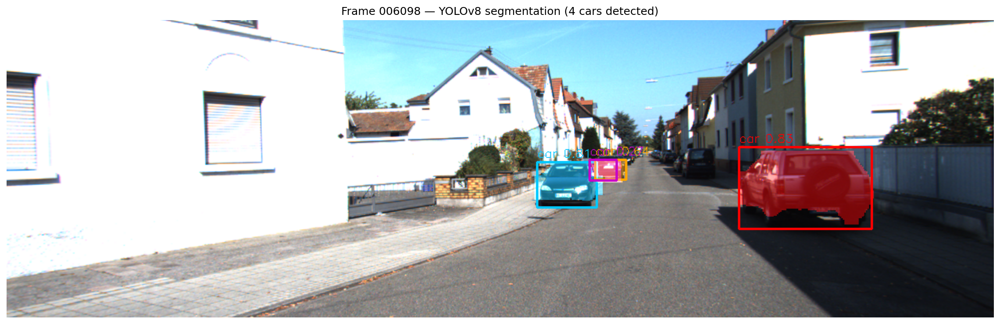 | 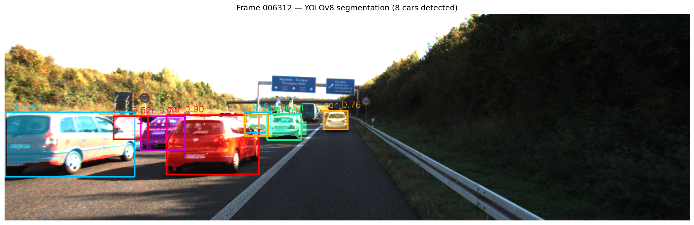 |
| 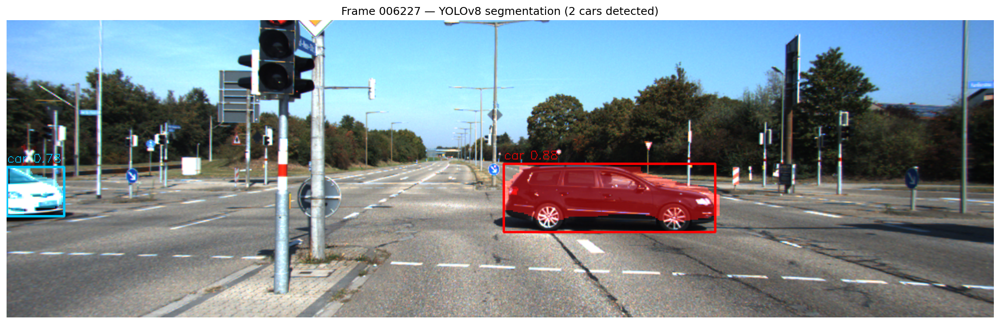 | 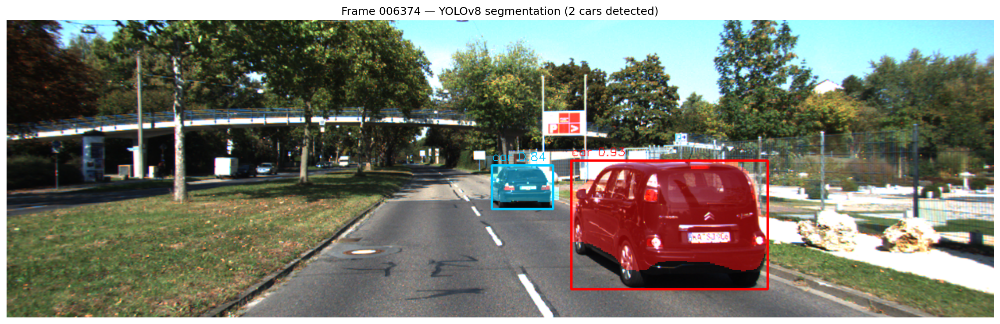 |

---

### 2. Bird's Eye View (BEV)
LiDAR points projected to a top-down 2D map with ground truth bounding boxes overlaid.

| | |
|---|---|
| 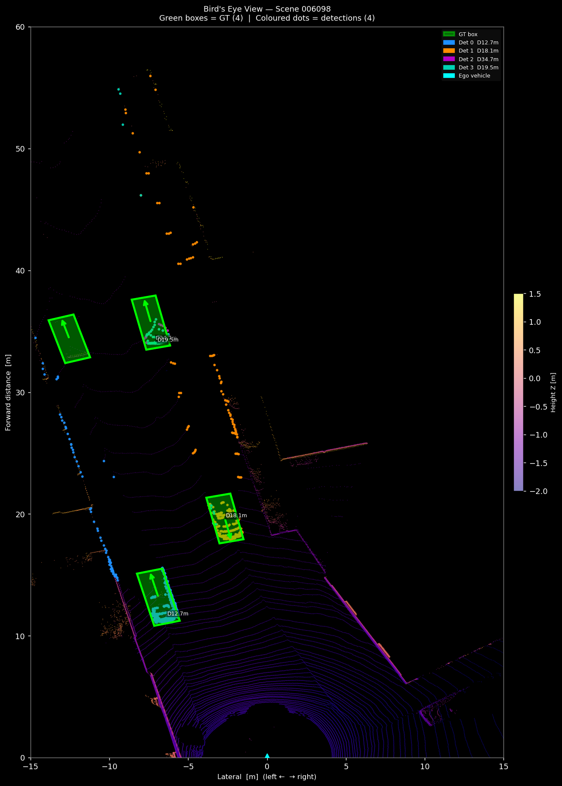 | 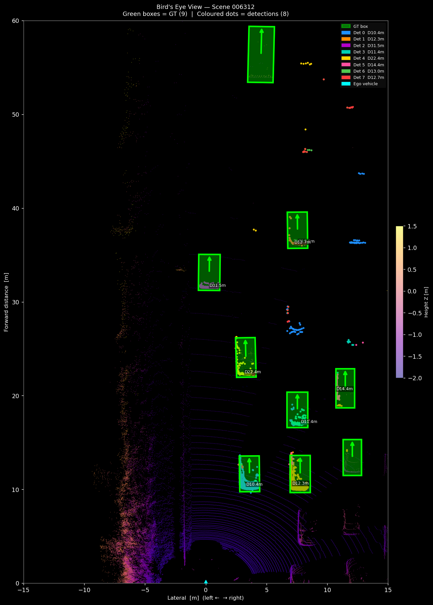 |
| 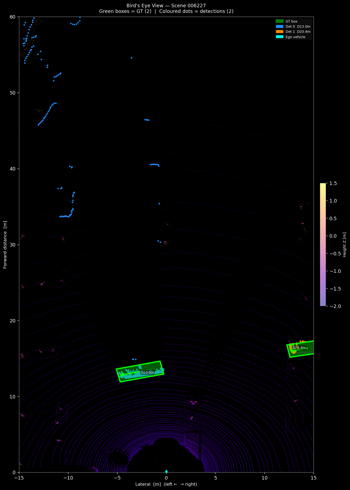 | 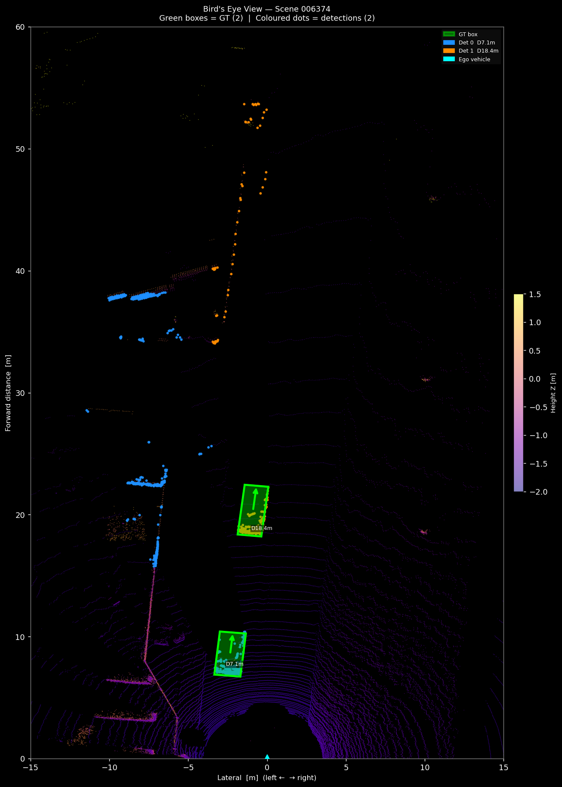 |

---

### 3. Camera–LiDAR Fusion (3D)
LiDAR points projected into the camera image plane and filtered by YOLO segmentation masks.

| | |
|---|---|
| 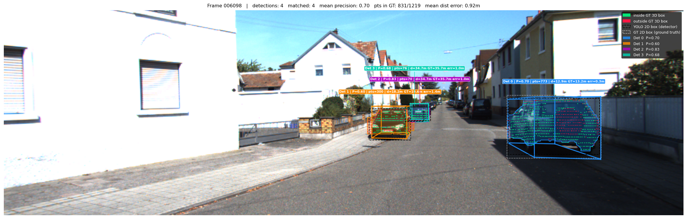 | 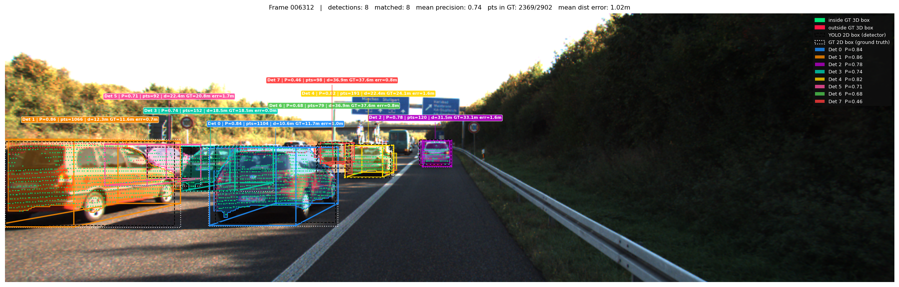 |
| 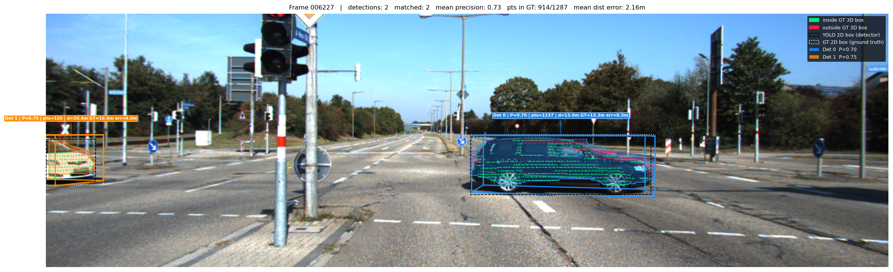 | 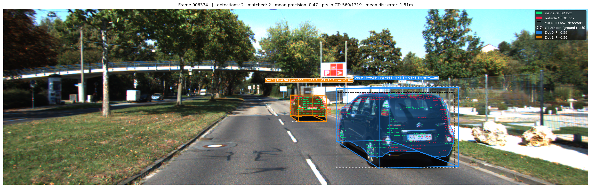 |

---

### 4. Evaluation Summary

| Metric | Value |
|--------|-------|
| Total YOLO detections | 125 |
| Matched to GT (IoU > 0) | 109 |
| LiDAR occluded (no distance) | 5 |
| Unmatched detections | 16 |
| Mean 3D Precision | 0.565 |
| Median 3D Precision | 0.683 |
| Detections with Precision > 0.5 | 74 / 109 |
| Detections with Precision > 0.7 | 50 / 109 |
| Mean distance error | 1.163 m |
| Median distance error | 1.149 m |
| Distance errors < 1 m | 40 / 104 |
| Distance errors < 2 m | 97 / 104 (93%) |
| Max distance error | 4.007 m |

**Precision Distribution:**

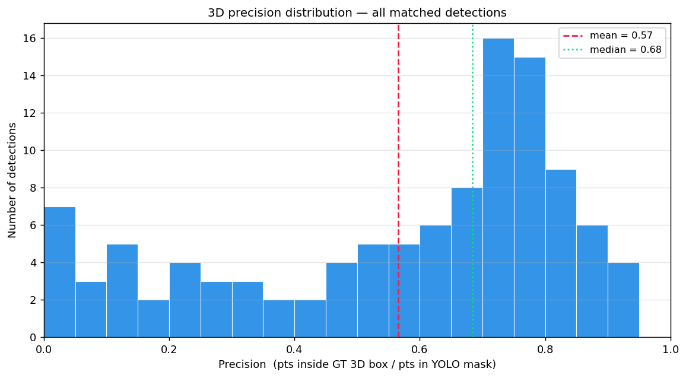

**Distance Error vs Ground Truth Distance:**

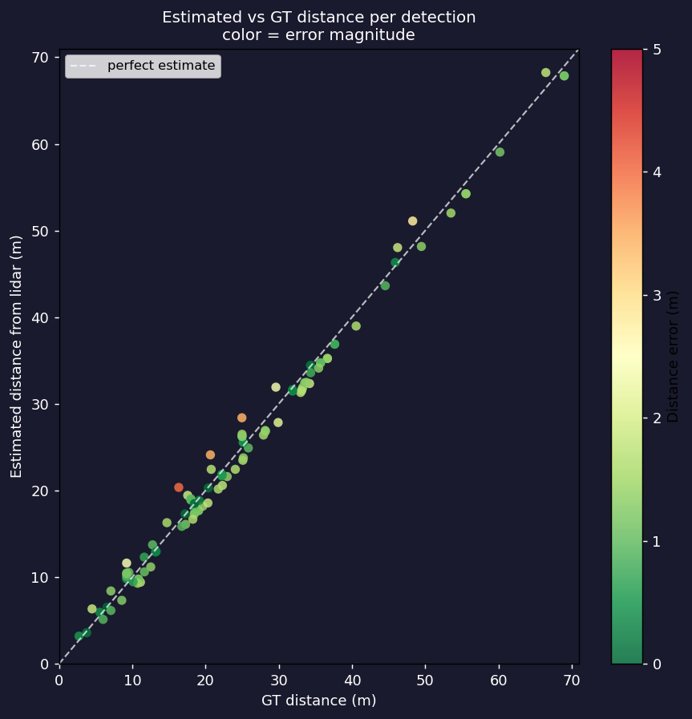

**Distance Error per Frame:**

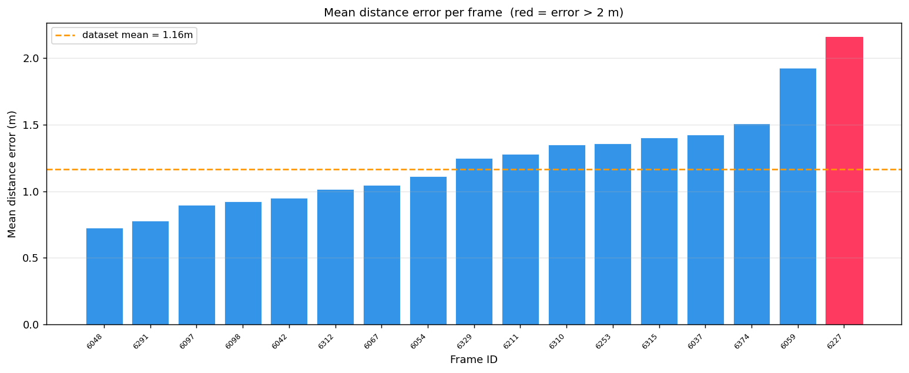

---

### 5. Ground Filter Improvement

A Z-axis threshold (`Z > -1.4 m` in LiDAR frame) removes ground points from the segmentation mask before computing precision. The sensor is mounted ~1.73 m above ground, so this threshold retains car body points while removing road surface returns.

| Metric | Before Filter | After Filter |
|--------|--------------|--------------|
| Mean Precision | 0.565 | 0.577 |
| Median Precision | 0.684 | 0.684 |
| Improved detections | — | 35 / 109 |
| Unchanged detections | — | 70 / 109 |
| Degraded detections | — | 4 / 109 |
| Max improvement (Δ) | — | +0.132 |

| Improvement Scatter | Improvement Histogram |
|--------------------|-----------------------|
| 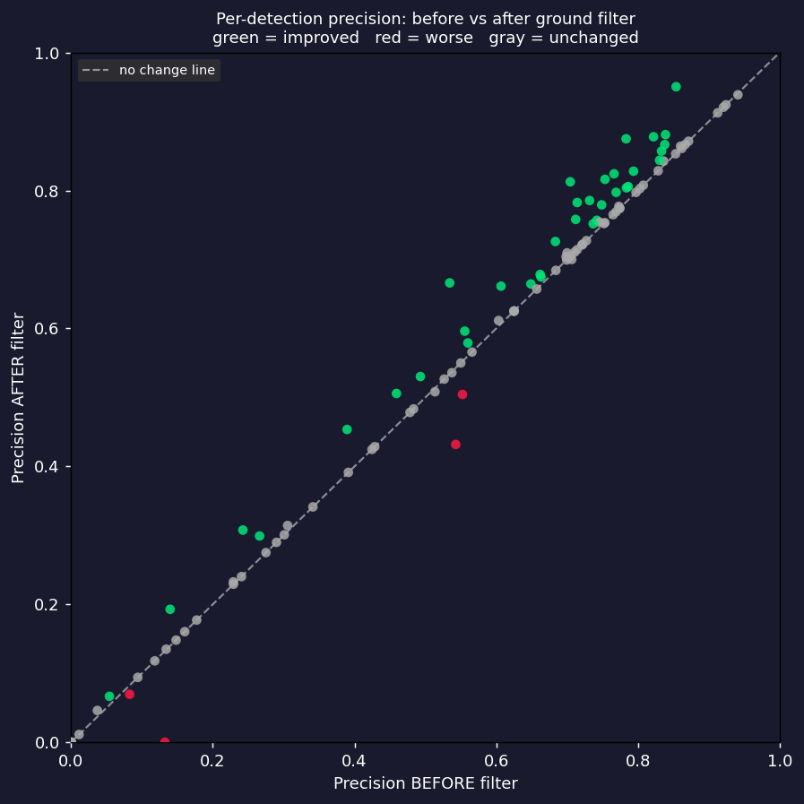 | 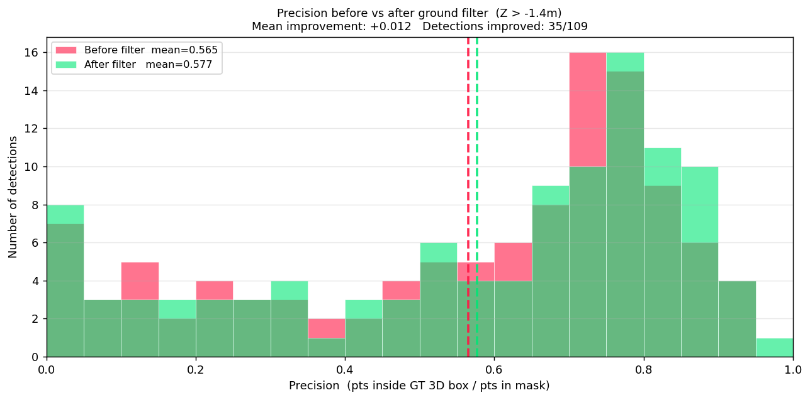 |

| Before Ground Filter | After Ground Filter |
|---------------------|---------------------|
| 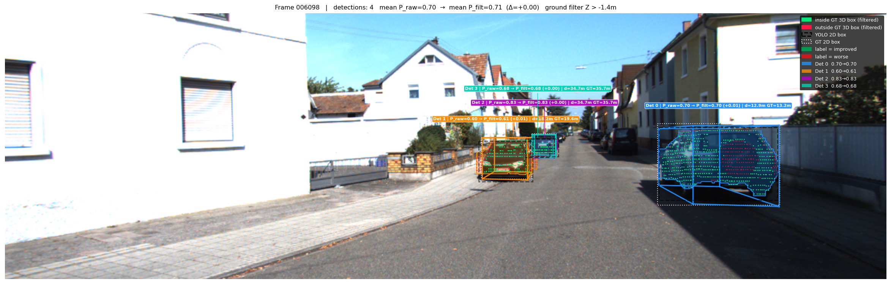 | 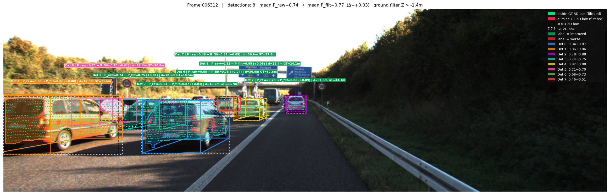 |

---

## Repo Structure
├── src/
│   ├── fusion_3D.py           # Main fusion pipeline + evaluation (all frames)
│   ├── fusion_improved.py     # Ground filter before/after comparison
│   ├── bev_visualization.py   # Bird's eye view LiDAR plots
│   ├── yolo_segmentation.py   # YOLOv8 detection + segmentation
│   ├── kitti_utils.py         # Calibration loading, LiDAR projection helpers
│   └── summary_analysis.py    # Aggregate statistics + plots
├── results/
│   ├── segmentation/          # YOLO detection outputs + detection_summary.csv
│   ├── bev/                   # BEV visualizations + bev_summary.csv
│   ├── fusion/                # Fusion visualizations + fusion_summary.csv
│   ├── fusion_improved/       # Ground filter comparison + improvement stats
│   └── summary/               # Dataset-level plots + summary_stats.txt
├── .gitignore
└── README.md
---

## How to Run

```bash
# Install dependencies
pip install ultralytics opencv-python numpy matplotlib

# 1. Run YOLOv8 segmentation
python src/yolo_segmentation.py

# 2. Generate Bird's Eye View plots
python src/bev_visualization.py

# 3. Run full camera-LiDAR fusion + evaluation
python src/fusion_3D.py

# 4. Ground filter comparison
python src/fusion_improved.py

# 5. Generate summary statistics and plots
python src/summary_analysis.py
```

> **Note:** Set `KITTI_ROOT` at the top of each script to your local KITTI dataset path.
> YOLOv8 model weights (`yolov8n-seg.pt`) are downloaded automatically by Ultralytics on first run.

---

## Key Findings

- Mean distance error of **1.16 m** using median LiDAR depth inside YOLO segmentation masks
- **93%** of detections achieved distance error below 2 m
- Ground point filtering improved precision in **35/109** detections with only 4 cases degraded
- 16 unmatched detections are primarily false positives or heavily occluded vehicles
- Higher distance errors correlate with farther objects where LiDAR point density is lower

---

## Dependencies

| Package | Purpose |
|---------|---------|
| `ultralytics` | YOLOv8 segmentation |
| `opencv-python` | Image loading and visualization |
| `numpy` | Point cloud processing |
| `matplotlib` | Plots and BEV visualization |